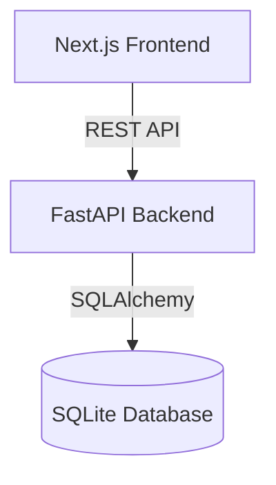

# TruthLens AI

TruthLens AI is a premium, educational full-stack web application designed to teach users how to identify AI-generated content across various media types (Image, Text, Code, Voice, Artwork).

It is not just a quiz, but an interactive, gamified learning platform.

## Features

*   **Multi-Media Detection:** Identify AI in images, text, code, voice, and artwork.
*   **Gamified Experience:** Score tracking, leaderboards, difficulty levels, XP, and achievements.
*   **Educational Insights:** Detailed explanations after every answer, highlighting common AI artifacts (e.g., unnatural anatomy, inconsistent lighting, repetitive text patterns, robotic voice cadences).
*   **Advanced Game Modes:** Timed mode, survival mode, and daily challenges.
*   **Premium UI/UX:** Built with Next.js, Tailwind CSS, shadcn/ui, and Framer Motion for smooth animations, dark mode, and a highly responsive design inspired by Duolingo and Perplexity.

## Architecture

*   **Frontend:** Next.js (App Router), TypeScript, Tailwind CSS, shadcn/ui, Framer Motion.
*   **Backend:** FastAPI (Python), SQLite/PostgreSQL, SQLAlchemy ORM.



## Setup Instructions

### 1. Backend Setup

1.  Navigate to the `backend` directory:
    ```bash
    cd backend
    ```
2.  Create and activate a virtual environment:
    ```bash
    python -m venv venv
    # Windows
    .\venv\Scripts\activate
    # macOS/Linux
    source venv/bin/activate
    ```
3.  Install dependencies:
    ```bash
    pip install fastapi uvicorn sqlalchemy pydantic python-multipart
    ```
4.  Run the FastAPI server:
    ```bash
    uvicorn main:app --reload
    ```
    The backend will be running at `http://localhost:8000`.

### 2. Frontend Setup

1.  Navigate to the `frontend` directory:
    ```bash
    cd frontend
    ```
2.  Install dependencies:
    ```bash
    npm install
    ```
3.  Run the Next.js development server:
    ```bash
    npm run dev
    ```
    The frontend will be running at `http://localhost:3000`.

### 3. Populating Sample Data

Once the backend is running, you can populate the database with sample questions by sending a POST request to:
`http://localhost:8000/populate_sample_data/`

## Screenshots

*(To be added)*
